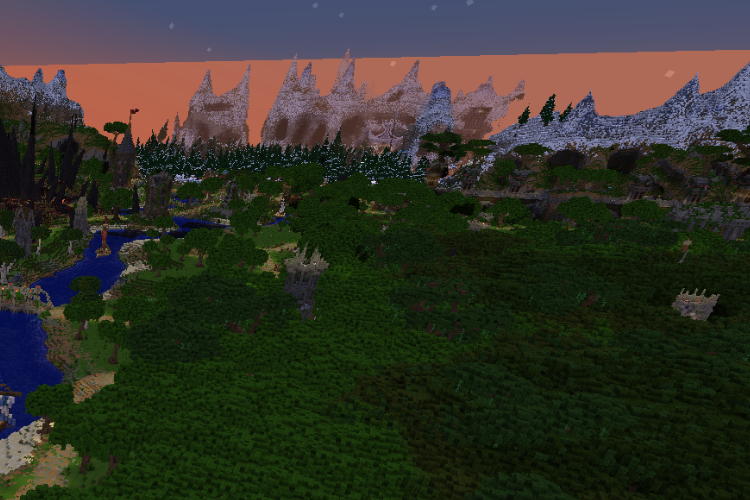
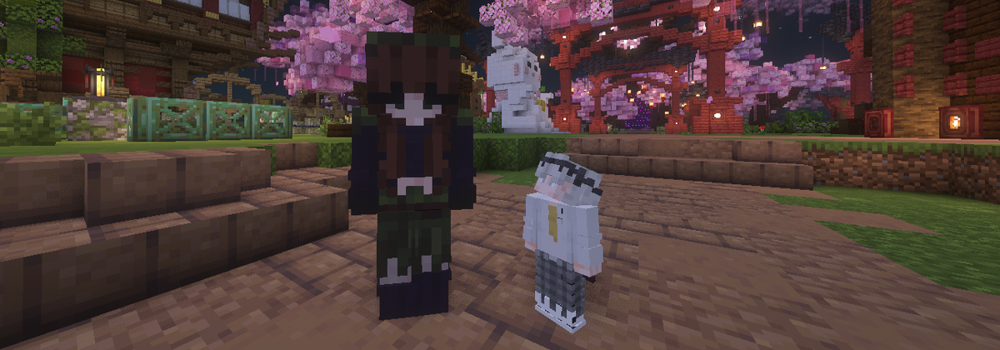

# Спонсор


[Ознакомиться со стоимостью можно на нашем сайте.](https://shop.sakeva.net/)


***

## Функционал

### **№1 Цветной никнейм**

Вам будет доступно **восемь** градиентных оттенков для вашего никнейма. Данный градиент способен подстроиться под длину вашего никнейма, можете не переживать.\
Ваш никнейм станет отображаться цветным в чате и табе.

Для установки необходимо зайти в меню спонсора, это делается командой - `/sponsor`

<figure><figcaption></figcaption></figure>

***

### **№2&#x20;**~~**Расширенная прорисовка**~~**&#x20;(ОТКЛЮЧЕНО)**

~~По стандарту у всех игроков стоит ограничение в **6 чанков** обзора, однако подписка способна изменить эти ограничения вплоть до **24 чанков**.~~

~~Для изменения необходимо зайти в меню спонсора, это делается командой - `/sponsor`~~

<figure><figcaption></figcaption></figure>

***

### **№3 Изменение роста**

Знали ли вы что стандартный рост персонажа в майнкрафт равняется **1.8 блоков**? Хотели бы вы попробовать стать ниже и выше? Подписка позволит изменить вам изменить значения роста. С помощью этого можно как начать копаться в **1 блок**, так и удобно возводить проекты ростом в **4 блока**.

Для изменения необходимо зайти в меню спонсора, это делается командой - `/sponsor`

<figure><figcaption></figcaption></figure>

***

### **№4 Личное время**

Хотели бы сделать красивый скриншот во время рассвета или во время затмения? С подпиской вам не нужно ждать этого времени, скриншот будет сделан здесь и сейчас.

Для изменения необходимо зайти в меню спонсора, это делается командой - `/sponsor` , однако если вы не хотите использовать систему с меню, то можете использовать альтернативную команду - `/ptime`

<figure><figcaption></figcaption></figure>

***

### **№5 Личная погода**

Надоел постоянный дождь или же гроза? С подпиской вам не нужно ждать его окончания, звуки и шум на экране прекратится здесь и сейчас.

Для изменения необходимо зайти в меню спонсора, это делается командой - `/sponsor` , однако если вы не хотите использовать систему с меню, то можете использовать альтернативную команду - `/pweather`

<figure><figcaption></figcaption></figure>

***

### **№6 Личные скины**

На нашем сервере используется система ресурс пака, с помощью которой мы смогли добавить систему скинов на сервер! Вам станет доступно **5 коллекций** оружия и инструментов, а это **21 скин**. Вдобавок к инструментам у вас будет доступ к **6 тотемам**, из которых **2 являются анимированными**.

Для наложения скина на предмет необходимо держать его в руки и зайти в меню спонсора, это делается командой - `/sponsor` , однако если вы не хотите использовать систему с меню, то можете использовать альтернативную команду - `/wraps`



<figure><figcaption></figcaption></figure>



<figure><figcaption></figcaption></figure>



<figure><figcaption></figcaption></figure>



<figure><figcaption></figcaption></figure>



<figure><figcaption></figcaption></figure>



<figure><figcaption></figcaption></figure>



***

### **№7 Бесконечное АФК**

На сервере действует система кика, если вы отсутствуете более 15 минут. С подпиской вы получаете полный иммунитет от киков за афк. Вы можете отнести пироги кенту и не беспокоиться, что наша система автоматически отключит вас от сервера.

Данный функционал действителен сразу после приобретения подписки.

***

### **№8 Невидимка на карте**

По стандарту всех игроков отображает на нашей онлайне карте сервера, однако с подпиской вы можете исчезнуть с радаров, так вас никто не сможет обнаружить в кратчайшие сроки.

Для скрытия с онлайн карты необходимо использовать команду - `/map hide`, однако если вы хотите вновь появится на онлайн карте вам надо будет прописать команду - `/map show`

***

### **Дополнительный функционал команд**

<table><thead><tr><th>Команда</th><th>Описание</th><th data-hidden></th></tr></thead><tbody><tr><td>/broadcast</td><td>Публикация красочных объявлений в чате сервера</td><td></td></tr><tr><td>/crawl</td><td>Перейти в состояние ползания</td><td></td></tr><tr><td>/spin</td><td>Начать крутиться на месте</td><td></td></tr><tr><td>/near</td><td>Обнаружить игроков поблизости</td><td></td></tr><tr><td>/hat</td><td>Поместить предмет в руке на слот головы</td><td></td></tr><tr><td>/itemname</td><td>Переименовать предмет в руке (доступны #HEX цвета)</td><td></td></tr><tr><td>/itemlore</td><td>Изменение описания предмета в руке (доступны #HEX цвета)</td><td></td></tr></tbody></table>

***

### Дополнительный функционал возможностей

> Заход на заполненный сервер.
>
> Приоритетная роль в дискорд сервере.
>
> Сообщение в чат после смерти игрового персонажа.
>
> Отключение упоминания вашего никнейма в чате.
>
> Приоритет технической поддержки.
>
> Доступ к розыгрышам для спонсоров.
>
> Отключение спонсоркой рекламы в чате сервера.
>
> Уведомление о скорой поломке предмета.

***

## Стоимость

<figure><figcaption></figcaption></figure>

| Длительность | Полная стоимость | Стоимость за день | Выгода        |
| ------------ | ---------------- | ----------------- | ------------- |
| **30** дней  | **299**₽         | **9,9**₽          | -             |
| **60** дней  | **569**₽         | **9,5**₽          | **5%**        |
| **90** дней  | **799**₽         | **8,9**₽          | **10%**       |
| **120** дней | **1019**₽        | **8,5**₽          | **15%**       |
| **150** дней | **1229**₽        | **8,2**₽          | **18%**       |
| **180** дней | **1429**₽        | **7,9**₽          | **20%**       |
| **∞** дней   | **4799**₽        | -                 | Более **90%** |
