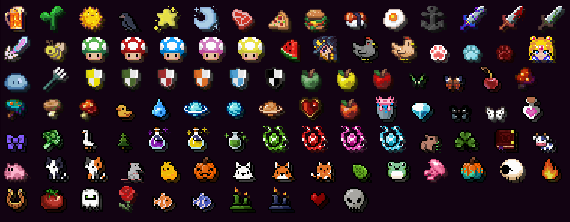

# Значки


[Ознакомиться со стоимостью можно на нашем сайте.](https://shop.sakeva.net/)


***

## Информация

Каждый игрок может выбрать и установить себе один из значков из доступных вариантов. Однако открываются они не сразу: чтобы получить доступ к конкретному значку, его нужно предварительно выбить из кейса со значками. Только после получения значка из кейса он становится доступен в меню и его можно будет установить в качестве своего текущего значка.

***

## Команды

| Команда             | Функционал               |
| ------------------- | ------------------------ |
| /crates open badges | Открыть кейс со значками |
| /badges             | Открыть меню значков     |

***

## Содержимое кейса


**Текущее количество доступных значков в кейсе** — **100 штук.**


<figure><figcaption></figcaption></figure>

***

## Стоимость кейсов

<figure><figcaption></figcaption></figure>

| Количество | Полная стоимость | Стоимость за штуку | Выгода  |
| ---------- | ---------------- | ------------------ | ------- |
| **1** шт   | **19**₽          | **19**₽            | -       |
| **5** шт   | **79**₽          | **15.8**₽          | **15**% |
| **10** шт  | **149**₽         | **14.9**₽          | **20**% |
| **25** шт  | **329**₽         | **13.2**₽          | **30**% |
| **100** шт | **949**₽         | **9.5**₽           | **50**% |
