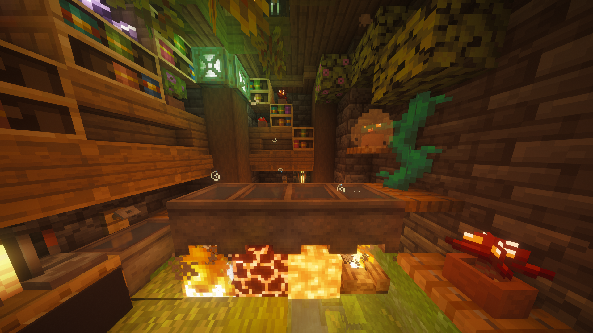
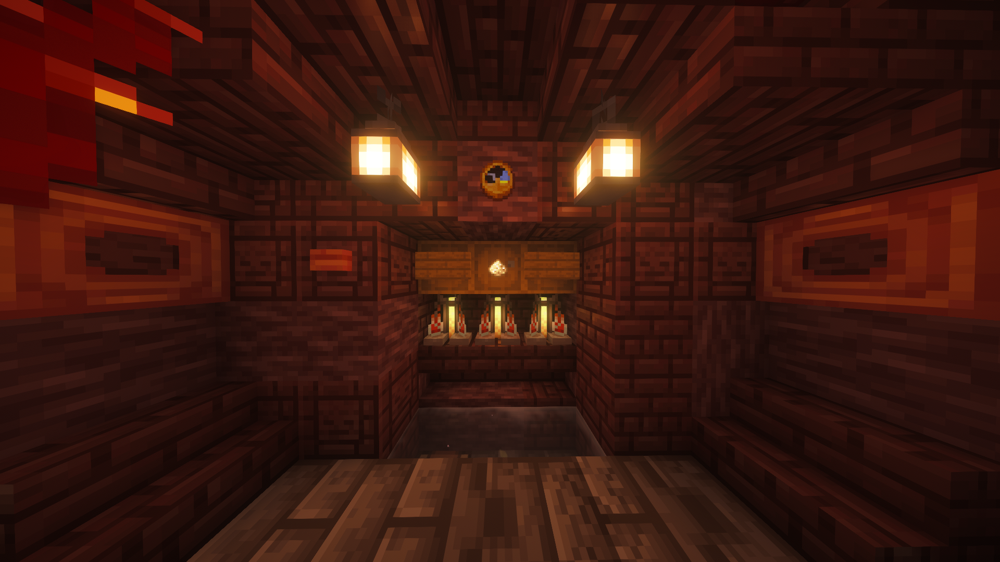
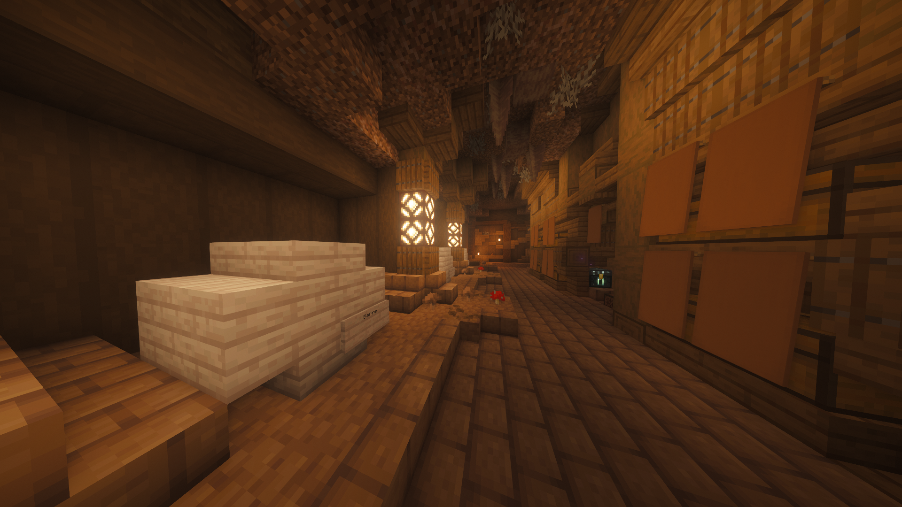
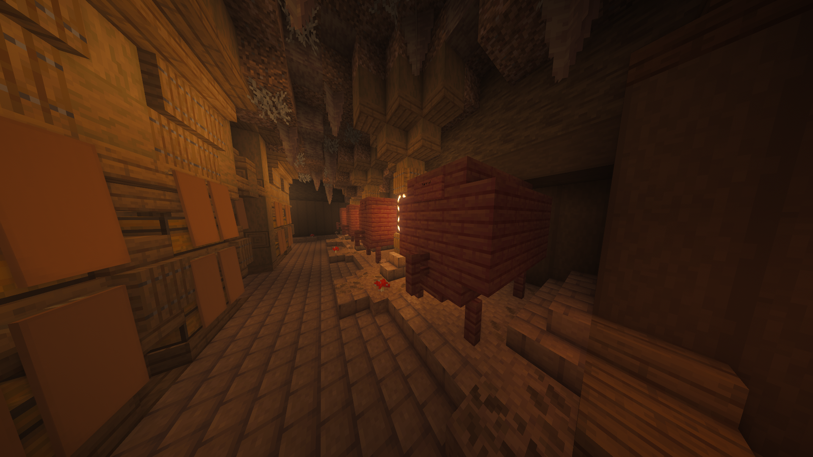

# Напитки

## **Как варить напитки?**

> Процесс варки напитков состоит из трёх этапов: ферментация, дистилляция и выдержка. Не все напитки требуют выполнения всех этапов – это зависит от рецепта.

Рассмотрим каждый этап подробнее.

***

## **Ферментация**

#### Процесс ферментации:

> * Поставьте **котёл** над открытым огнём, магмой, лавой или костром и наполните его водой.
> * Добавьте нужные ингредиенты щелчком правой кнопкой мыши.
> * Подождите нужное количество времени, пока напиток сварится. Чтобы узнать текущее время ферментации, нажмите на котёл правой кнопкой мыши с часами в руке.\
>   В чате появится сообщение о прошедшем времени с момента загрузки последнего ингредиента. В первые две минуты будет отображаться сообщение: «Котел только начал кипеть».
> * Когда время ферментации закончится, возьмите пустую бутылочку, щёлкните по котлу правой кнопкой мыши и напиток перельётся в бутылочку. С одного полного котла можно получить 3 бутылочки напитка.

<figure><figcaption></figcaption></figure>


**Важно:** Котлы можно ставить вплотную друг к другу, но под каждым должен находиться источник тепла.


***

## **Дистилляция**

Некоторые напитки требуют дистилляции. Для этого необходима **зельеварка**. Если в рецепте не указан этап дистилляции, значит переходите к следующему шагу - выдержка.

#### Процесс дистилляции:

> * Поместите **бутылочки с напитком** полученные с этапа ферментации в зельеварку.
> * В слот для ингредиентов поместите **светокаменную пыль** (замена не требуется, она действует постоянно).
> * Процесс останавливается автоматически при достижении нужного количества циклов. После нескольких циклов дистилляции (зависит от рецепта), дождитесь завершения указанного в рецепте и забери бутылки назад.

<figure><figcaption></figcaption></figure>


**Важно:** Если попытаться дистиллировать напиток, не предназначенный для этого процесса, его качество начнёт ухудшаться, и он превратится в мутный дистиллят.


***

## **Выдержка**

Последний этап – выдержка. Для этого требуется **бочка**.

#### Время выдержки:

> 1 год выдержки равен 20 минутам реального времени.

#### Процесс выдержки:

> * Откройте бочку, щелкнув правой кнопкой мыши и поместите бутылки внутрь.
> * По достижению необходимого срока выдержки, заберите готовый напиток.
> * В зависимости от рецепта, определённые напитки должны выдерживаться лишь в бочках определённого типа досок (берёзовые, дубовые, тропические, еловые, акациевые, тёмно-дубовые, багровые, искажённые)


**Важно:** Если в рецепте не указан этап выдержки, значит напиток должен был получиться на предыдущем этапе.


**Малая бочка**

* Требуется: 8 ступеней и табличка с надписью «Barrel» в правом нижнем углу.
* Содержит 9 слотов под напитки.
* При правильной сборке в чате появится сообщение «Бочка создана».

<figure><figcaption></figcaption></figure>

**Большая бочка**

* Требуется: 16 ступеней, 18 досок, 5 заборов и табличка с надписью «Barrel» посередине сверху .
* Содержит 27 слотов под напитки.
* При правильной сборке в чате появится сообщение «Бочка создана».

<figure><figcaption></figcaption></figure>

***

#### **Особенности размещения:**

* Бочки можно ставить вплотную друг к другу.
* Не располагайте бочки рядом с деревянными стенами, иначе они могут потерять свойства: перестанут открываться и выбросят содержимое в виде предметов.


Обычные бочки Майнкрафта для выдержки не подходят, но их можно использовать для хранения готовых напитков.

