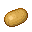
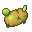
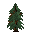
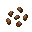
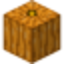

# Рецепты Напитков


Вы можете приобрести свой уникальный рецепт [на нашем сайте](https://store.sakeva.ru/)!


***

## Дополнительная информация

У всех игроков есть возможность придумать собственный напиток, его характеристики будут зависеть от пожеланий автора.

Рецепт будет рассмотрен на предмет баланса и соответствия механике игры, чтобы сохранить интересный и честный геймплей для всех. Если напиток пройдет одобрение, то он появится на сервере, однако другие игроки оповещены об этом не будут.

Свои характеристики в напитке — это не только шанс проявить креативность, но и внести реальный вклад в развитие комьюнити, ведь новые рецепты создают разнообразие и делают игру интереснее для всех участников!

<figure><figcaption></figcaption></figure>

***

## Алкогольные рецепты

<table><thead><tr><th width="125" align="center">Название</th><th width="130" align="center" valign="middle">Ингредиенты</th><th width="125" align="center">Ферментация</th><th width="165" align="center">Выдержка</th><th width="120" align="center">Дистилляция</th><th align="center">Крепость</th></tr></thead><tbody><tr><td align="center">Ягодное шампанское</td><td align="center" valign="middle"><strong>20</strong> </td><td align="center"><strong>12</strong> минут</td><td align="center"><strong>5</strong> лет Любая бочка</td><td align="center"><strong>-</strong></td><td align="center"><strong>5</strong>%</td></tr><tr><td align="center">Пшеничное пиво</td><td align="center" valign="middle"><strong>3</strong> </td><td align="center"><strong>8</strong> минут</td><td align="center"><strong>2</strong> года Березовая бочка</td><td align="center"><strong>-</strong></td><td align="center"><strong>6</strong>%</td></tr><tr><td align="center">Темное пиво</td><td align="center" valign="middle"><strong>6</strong> </td><td align="center"><strong>8</strong> минут</td><td align="center"><strong>8</strong> лет Тёмно-дубовая бочка</td><td align="center"><strong>-</strong></td><td align="center"><strong>8</strong>%</td></tr><tr><td align="center">Красное вино</td><td align="center" valign="middle"><strong>5</strong> </td><td align="center"><strong>5</strong> минут</td><td align="center"><strong>20</strong> лет Любая бочка</td><td align="center"><strong>-</strong></td><td align="center"><strong>8</strong>%</td></tr><tr><td align="center">Яблочный сидр</td><td align="center" valign="middle"><strong>14</strong> </td><td align="center"><strong>7</strong> минут</td><td align="center"><strong>3</strong> года Любая бочка</td><td align="center"><strong>-</strong></td><td align="center"><strong>9</strong>%</td></tr><tr><td align="center">Виски</td><td align="center" valign="middle"><strong>10</strong> </td><td align="center"><strong>10</strong> минут</td><td align="center"><strong>18</strong> лет Еловая бочка</td><td align="center"><strong>2</strong> цикла</td><td align="center"><strong>26</strong>%</td></tr><tr><td align="center">Ром</td><td align="center" valign="middle"><strong>18</strong> </td><td align="center"><strong>6</strong> минут</td><td align="center"><strong>14</strong> лет Дубовая бочка</td><td align="center"><strong>2</strong> цикла</td><td align="center"><strong>30</strong>%</td></tr><tr><td align="center">Водка</td><td align="center" valign="middle"><strong>10</strong> </td><td align="center"><strong>15</strong> минут</td><td align="center"><strong>-</strong></td><td align="center"><strong>3</strong> цикла</td><td align="center"><strong>20</strong>%</td></tr><tr><td align="center">Водка с грибами</td><td align="center" valign="middle"><strong>10</strong>  <strong>3</strong>  <strong>3</strong> </td><td align="center"><strong>16</strong> минут</td><td align="center"><strong>-</strong></td><td align="center"><strong>5</strong> циклов</td><td align="center"><strong>18</strong>%</td></tr><tr><td align="center">Джин</td><td align="center" valign="middle"><strong>9</strong>  <strong>6</strong>  <strong>1</strong> </td><td align="center"><strong>6</strong> минут</td><td align="center"><strong>-</strong></td><td align="center"><strong>2</strong> цикла</td><td align="center"><strong>20</strong>%</td></tr><tr><td align="center">Текила</td><td align="center" valign="middle"><strong>8</strong> </td><td align="center"><strong>15</strong> минут</td><td align="center"><strong>12</strong> лет Берёзовая бочка</td><td align="center"><strong>2</strong> цикла</td><td align="center"><strong>20</strong>%</td></tr><tr><td align="center">Зеленый абсент</td><td align="center" valign="middle"><strong>17</strong>  <strong>2</strong> </td><td align="center"><strong>5</strong> минут</td><td align="center"><strong>-</strong></td><td align="center"><strong>6</strong> циклов</td><td align="center"><strong>46</strong>%</td></tr><tr><td align="center">Самогон</td><td align="center" valign="middle"><strong>3</strong>  <strong>1</strong> </td><td align="center"><strong>8</strong> минут</td><td align="center"><strong>-</strong></td><td align="center"><strong>4</strong> цикла</td><td align="center"><strong>28</strong>%</td></tr><tr><td align="center">Чача</td><td align="center" valign="middle"><strong>3</strong>  <strong>1</strong>  <strong>5</strong> </td><td align="center"><strong>6</strong> минут</td><td align="center"><strong>6</strong> лет Акациевая бочка</td><td align="center"><strong>1</strong> цикл</td><td align="center"><strong>33</strong>%</td></tr><tr><td align="center">Саке</td><td align="center" valign="middle"><strong>6</strong>  <strong>3</strong>  <strong>6</strong> </td><td align="center"><strong>10</strong> минут</td><td align="center"><strong>9</strong> лет Тропическая бочка</td><td align="center"><strong>1</strong> цикл</td><td align="center"><strong>69</strong>%</td></tr><tr><td align="center">Квас</td><td align="center" valign="middle"><strong>3</strong>  <strong>2</strong>  <strong>1</strong> </td><td align="center"><strong>6</strong> минут</td><td align="center"><strong>3</strong> года Любая бочка</td><td align="center"><strong>-</strong></td><td align="center"><strong>3</strong>%</td></tr><tr><td align="center">Сливочное пиво</td><td align="center" valign="middle"><strong>1</strong>  <strong>6</strong>  <strong>5</strong> </td><td align="center"><strong>8</strong> минут</td><td align="center"><strong>3</strong> года Тёмно-дубовая бочка</td><td align="center"><strong>-</strong></td><td align="center"><strong>13</strong>%</td></tr><tr><td align="center">Глинтвейн</td><td align="center" valign="middle"><strong>5</strong>  <strong>2</strong>  <strong>1</strong> </td><td align="center"><strong>12</strong> минут</td><td align="center"><strong>-</strong></td><td align="center"><strong>1</strong> цикл</td><td align="center"><strong>8</strong>%</td></tr><tr><td align="center">Кумыс</td><td align="center" valign="middle"><strong>2</strong>  <strong>3</strong>  <strong>1</strong> </td><td align="center"><strong>10</strong> минут</td><td align="center"><strong>-</strong></td><td align="center"><strong>1</strong> цикл</td><td align="center"><strong>8</strong>%</td></tr><tr><td align="center">Медовуха</td><td align="center" valign="middle"><strong>8</strong>  <strong>2</strong> </td><td align="center"><strong>10</strong> минут</td><td align="center"><strong>4</strong> года Дубовая бочка</td><td align="center"><strong>-</strong></td><td align="center"><strong>10</strong>%</td></tr><tr><td align="center">Jägermeister</td><td align="center" valign="middle"><strong>10</strong>  <strong>4</strong>  <strong>4</strong> </td><td align="center"><strong>12</strong> минут</td><td align="center"><strong>3</strong> года Дубовая бочка</td><td align="center"><strong>-</strong></td><td align="center"><strong>35</strong>%</td></tr><tr><td align="center">Эль</td><td align="center" valign="middle"><strong>3</strong>  <strong>8</strong> </td><td align="center"><strong>9</strong> минут</td><td align="center">
<strong>6</strong> лет

Дубовая бочка
</td><td align="center"><strong>-</strong></td><td align="center"><strong>25</strong>%</td></tr><tr><td align="center">Рижский бальзам</td><td align="center" valign="middle"><strong>5</strong>  <strong>2</strong>  <strong>1</strong>  <strong>1</strong>  <strong>1</strong>  <strong>1</strong> </td><td align="center"><strong>10</strong> минут</td><td align="center"><strong>10</strong> лет Дубовая бочка</td><td align="center"><strong>2</strong> цикла</td><td align="center"><strong>40</strong>%</td></tr><tr><td align="center">Драконий коньяк</td><td align="center" valign="middle"><strong>20</strong>  <strong>3</strong> </td><td align="center"><strong>6</strong> минут</td><td align="center"><strong>100</strong> лет Дубовая бочка</td><td align="center"><strong>-</strong></td><td align="center"><strong>100</strong>%</td></tr><tr><td align="center">Шампанское</td><td align="center" valign="middle"><strong>10</strong>  <strong>3</strong> </td><td align="center"><strong>5</strong> минут</td><td align="center"><strong>10</strong> лет Любая бочка</td><td align="center"><strong>-</strong></td><td align="center"><strong>13</strong>%</td></tr></tbody></table>

***

## Отрезвители

<table><thead><tr><th width="135" align="center">Название</th><th width="140" align="center" valign="top">Ингредиенты</th><th width="120" align="center">Ферментация</th><th width="140" align="center">Выдержка</th><th width="120" align="center">Дистилляция</th><th align="center">Снижает</th></tr></thead><tbody><tr><td align="center">Картофельный суп</td><td align="center" valign="top"><strong>5</strong>  <strong>3</strong> </td><td align="center"><strong>3</strong> минуты</td><td align="center"><strong>-</strong></td><td align="center"><strong>-</strong></td><td align="center"><strong>30</strong>%</td></tr><tr><td align="center">Кофе</td><td align="center" valign="top"><strong>12</strong>  <strong>2</strong> </td><td align="center"><strong>2</strong> минуты</td><td align="center"><strong>-</strong></td><td align="center"><strong>-</strong></td><td align="center"><strong>50</strong>%</td></tr><tr><td align="center">Зеленый чай</td><td align="center" valign="top"><strong>1</strong>  <strong>3</strong> </td><td align="center"><strong>6</strong> минут</td><td align="center"><strong>-</strong></td><td align="center"><strong>-</strong></td><td align="center"><strong>20</strong>%</td></tr><tr><td align="center">Огуречный рассол</td><td align="center" valign="top"><strong>3</strong>  <strong>10</strong> </td><td align="center"><strong>10</strong> минут</td><td align="center"><strong>-</strong></td><td align="center"><strong>-</strong></td><td align="center"><strong>90</strong>%</td></tr><tr><td align="center">Тыквенный сок</td><td align="center" valign="top"><strong>2</strong>  <strong>3</strong> </td><td align="center"><strong>6</strong> минут</td><td align="center"><strong>-</strong></td><td align="center"><strong>-</strong></td><td align="center"><strong>35</strong>%</td></tr></tbody></table>
